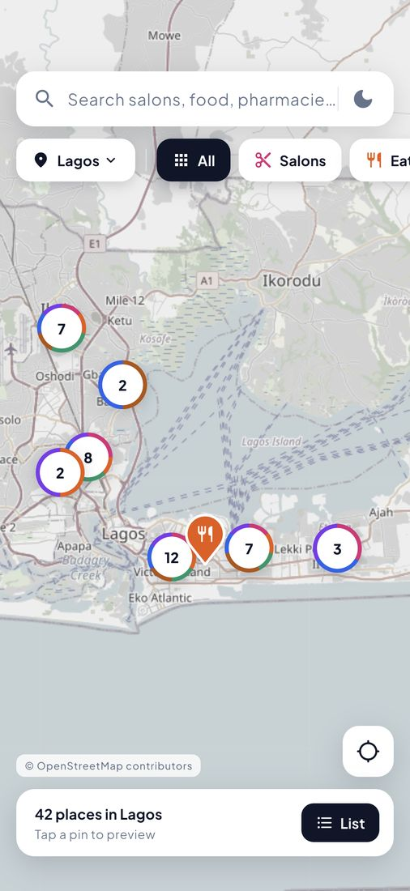
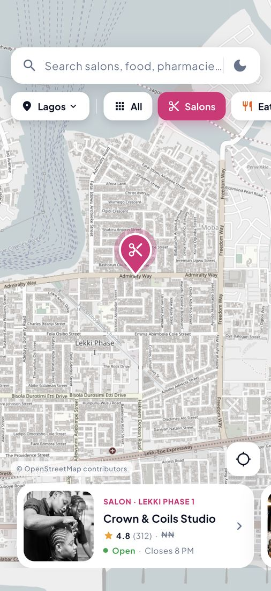
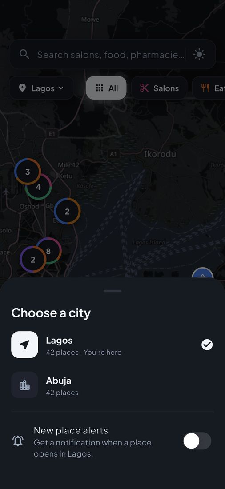
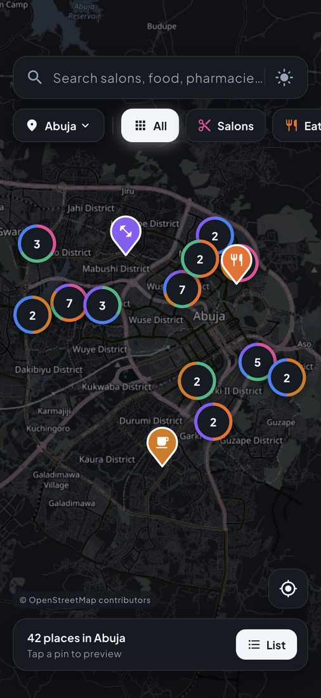

# Spotly

Find salons, eateries, pharmacies, cafés, supermarkets and gyms in Lagos and Abuja on a map.

Spotly opens on a map centred on you, in whichever of the two cities you're in. You can search in plain words ("saloon", "jollof", "chemist") or tap a category, and each result shows up as a pin in its category's colour. Tap a pin to preview the place, then open the preview for full details: photos, opening hours, directions, call and share. The whole app has light and dark themes, including the map.

| Map | Preview | Details | Cities | Abuja, dark |
| --- | --- | --- | --- | --- |
|  |  |  |  |  |

## Running it

```bash
flutter pub get
flutter run
```

It needs no API keys. Places load from Cloud Firestore (the `spotly-lagos` project is already configured), and the app falls back to the same 84 places (42 per city) bundled in `assets/data/places.json` if Firestore is unreachable. To skip Firebase entirely, run `flutter run --dart-define=DATA_SOURCE=bundled`. The iOS simulator starts in California, so either set a Lagos or Abuja location (**Features → Location → Custom Location**, e.g. `6.445, 3.470` or `9.075, 7.472`) or let the app fall back to showing Lagos.

```bash
flutter test          # unit and widget tests
flutter analyze       # strict lints, zero issues

# End-to-end on a simulator/emulator. Walks through search, preview,
# details, dark mode and switching to Abuja, and writes screenshots to
# screenshots/
flutter drive --driver=test_driver/integration_test.dart \
  --target=integration_test/app_flow_test.dart
```

The images in `docs/screenshots` are compressed copies of that run.

## Features

- **Unique category pins.** Each category has its own colour and icon. The selected pin grows and glows, and new pins pop in when results change.
- **Category-aware clustering.** When zoomed out, nearby pins merge into a bubble whose ring is a small donut chart of the categories inside it. Tap a bubble to zoom in to its places.
- **Forgiving search.** Every word has to match a place's name, category, highlights or neighbourhood. Synonyms work ("saloon" and "barber" find salons, "chemist" finds pharmacies), as do plurals, accents and one-letter typos ("pharmcy", "resturant"). Results are ranked by match quality, then distance, then rating.
- **Pins and cards stay in sync.** Tapping a pin scrolls the card carousel to it, and swiping the carousel moves the map to that pin. The map always frames the results in the clear space between the search bar and the cards.
- **Details screen.** Collapsing photo header with a hero transition, live open/closed status ("Closes soon · 9 PM"), highlights, a weekly hours table with today marked, a mini map, a photo gallery, and Directions / Call / Share / Copy address.
- **Light and dark themes.** Follows the system setting until you use the toggle, then remembers your choice. The map tiles are recoloured on the device to match the theme.
- **Two cities.** A city chip at the start of the category row switches between Lagos and Abuja. The camera zooms out, flies across and lands on the other city, and search, filters, counts and the results list all follow the selected city. The choice is remembered across launches.
- **Location aware.** Opens on your city when you're in Lagos or Abuja, centres on you and sorts results by distance. If you're somewhere else it shows the last city you picked and tells you why. Denied permissions get a clear message and a link to Settings.
- **Seamless launch.** The native launch screen hands off to a Flutter splash drawn at exactly the same size and position, which plays a short pin-drop intro while places load, then fades into the map. It waits for data for at most 2.6 s, and skips the animation when the system's reduce-motion setting is on.
- **Every state is handled.** Loading, empty results (with a "Clear" action), load errors (with "Retry"), deep links to a place that doesn't exist, and Android back to dismiss a selection.
- **Accurate hours.** Opening hours are evaluated in West Africa Time (WAT, UTC+1, both cities' time zone) wherever the viewer is. Late-night windows that cross midnight (e.g. 17:00–02:00) and 24-hour places are handled.

## Firebase

- **Reads.** `FirestorePlaceRepository` reads the `places` collection. Locations are stored as native `GeoPoint`s, ready for geo queries.
- **Fallback.** `FallbackPlaceRepository` wraps Firestore and switches to the bundled data if Firestore fails, times out (8 s) or returns nothing. The map is never empty because of the backend.
- **Security rules.** `firestore.rules` makes `places` public and read-only, and denies everything else. Clients can't write anything.
- **Seeding.** `dart run tool/seed_firestore.dart` uploads `assets/data/places.json` and removes stale documents. Because clients can't write, it deploys temporary rules that allow writes to `places` only, for ten minutes. It then always redeploys the locked rules, even if the upload fails.
- **Using your own project.** Run `flutterfire configure`, then the seed script, then `firebase deploy --only firestore:rules`. `DATA_SOURCE=bundled` skips Firebase entirely, including push.

## Push notifications

- **Opt in, per city.** Turning on **New place alerts** in the city picker asks for notification permission at that moment, not at launch. The app then follows the selected city's FCM topic (`places-lagos` or `places-abuja`) and switches topics when you switch cities.
- **Tapping one opens the place**, whether the app was in the background or closed. From a cold start the splash hands straight over to the details screen. The map behind it moves to the place's city, so going back shows where it is.
- **In the app**, where the system doesn't show notifications, they slide in as a banner that opens the place or can be swiped away.
- **Android** works out of the box, with the Android 13+ permission prompt, a monochrome status-bar pin and a "New places" notification channel.
- **iOS** is wired up but needs the Push Notifications capability and an APNs key, which require a paid Apple Developer account. They're left out so anyone can build the project. Without them there's no APNs token, so the switch says notifications aren't available in this build instead of asking for a permission it can't use. To turn iOS on, add the Push Notifications capability to the Runner target in Xcode, upload an APNs auth key under Firebase console → Project settings → Cloud Messaging, and rebuild. No code changes are needed.
- **Sending one.** `dart run tool/send_push.dart --place zuri-hair-atelier` sends "New in Abuja: Zuri Hair Atelier" to that place's city topic, authorised with `gcloud auth print-access-token` (or pass `--access-token`). The Firebase console works too: create a notification that targets the topic `places-abuja` and add the custom data `placeId` with a place's id.

The Firebase config files in the repo (`firebase_options.dart`, `google-services.json`, `GoogleService-Info.plist`) contain public project identifiers, not secrets. Access is governed by the security rules.

## Architecture

Code is organised by feature, with a small layer stack inside each feature. Riverpod handles state and go_router handles navigation.

```
lib/
  core/            theme tokens (AppPalette), router, formatters
  features/
    places/
      domain/        Place, City, PlaceCategory, OpeningHours, PlaceSearch, PlaceRepository
      data/          FirestorePlaceRepository, AssetPlaceRepository, FallbackPlaceRepository
      application/   providers: places, selected city, filter, search results, selection, clock
      presentation/  map/ (screen, pins, clustering, carousel, search) · details/ · common/
    location/      LocationService (geolocator) + UserLocation provider
    notifications/ PushService (FCM topics per city), alerts toggle, in-app banner
    splash/        animated hand-off from the native launch screen
    settings/      persisted ThemeMode
assets/data/places.json   sample data
```

- **The domain layer is plain Dart.** Search ranking and opening-hours logic are pure functions, so they're thoroughly unit tested.
- **The data source can be swapped.** The UI only depends on `PlaceRepository`. `main.dart` picks Firestore with the bundled fallback, and tests inject fakes through a single provider override.
- **Search runs on the device.** Firestore has no full-text search. With a city-sized dataset, fetching once and searching locally is instant and works offline. At larger scale it would move to a search service (Algolia, Typesense) with geohash queries.
- **Testable seams.** The location service, repository, push service, clock and map tiles are all providers, so tests swap in fakes and need no network, GPS or Firebase.

## Tech

Flutter 3.44 · Dart 3.12 · Cloud Firestore · Firebase Cloud Messaging · flutter_riverpod 3 · go_router · flutter_map + OpenStreetMap · geolocator · cached_network_image · url_launcher · share_plus · shared_preferences

## Notes

- **Sample data.** All businesses, phone numbers and ratings are fictional. Streets and coordinates are real, and each pin was checked by reverse geocoding to make sure it sits on the named street. Phone numbers use unassigned Lagos (01) and Abuja (09) ranges, so tapping Call can never reach a real person.
- **Photos** are from [Unsplash](https://unsplash.com) and are requested at the size they're displayed.
- **Firestore region.** The database is in `nam5` (US multi-region) because the CLI created it automatically on first deploy. A production app for Nigeria would use a European region such as `europe-west2` for lower latency.
- **Map tiles** are © [OpenStreetMap contributors](https://www.openstreetmap.org/copyright), used within the [tile usage policy](https://operations.osmfoundation.org/policies/tiles/) for low-volume apps. A production release should switch to a commercial tile provider.
